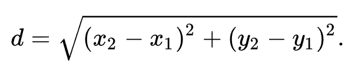

# COMP2511 Assignment-i <!-- omit in toc -->

## Due: Week 5 Wednesday, 3pm [Sydney Local Time](https://www.timeanddate.com/worldclock/australia/sydney) (15th October 2025) <!-- omit in toc -->

## Maximum 5 day late penalty [Sydney Local Time](https://www.timeanddate.com/worldclock/australia/sydney) (20th October 2025) <!-- omit in toc -->

Key notes:

- There are no "Short Extensions" from Special Consideration for this assignment.
- 5% per day late penalty calculated per-hour to the next hour. Maximum of 5 days late penalty. No submissions will be accepted greater than 5 days after the assignment due date.
- ELS/ELP and Special Consideration will have maximum 7 days of an extension which includes the maximum 5 days late penalty.
- Submission must be pushed onto the `main` branch on GitLab. See submission instructions [here](#submission-id).
- Ensure your submission passes our dryrun [here](#dryruns-id).
- Please visit the [course website](https://cgi.cse.unsw.edu.au/~cs2511/25T3/els-spec-cons) for Special Consideration or ELS/ELP provisions.

Examples for late submissions:

- If you submit 5 days late (original due date + 5 days), your mark will be reduced by 20%.
- If you submit 5 days, 3 hours late (original due date + 5 days, 3 hours), any work completed after the 5 day mark will not be marked or accepted.
- If you have a 7 day extension, the latest submission accepted is original due date + 7 days.
- If you have a 7 day extension and ELP/ELS for 7 days, the latest submission accepted is original due date + 7 days + 7 days.

## Changelog <!-- omit in toc -->

- 25/09/25: Added assumptions section (section 1.3)
- 25/09/25: Fixed typo for submission cutoff from 7 days -> 5 days after the deadline (section 10.1)

## Table Of Contents <!-- omit in toc -->

- [1. Introduction](#1-introduction)
  - [1.1. Simulation](#11-simulation)
  - [1.2. Positions](#12-positions)
  - [1.3. Assumptions](#13-assumptions)
- [2. Your Tasks](#2-your-tasks)
  - [2.1. Task A - Modelling](#21-task-a---modelling)
    - [2.1.1. Task a i) Create Train Station](#211-task-a-i-create-train-station)
    - [2.1.2. Task a ii) Create Train Track](#212-task-a-ii-create-train-track)
    - [2.1.3. Routes 🛣](#213-routes-)
      - [2.1.3.1. Linear Routes](#2131-linear-routes)
      - [2.1.3.2. Cyclical Routes](#2132-cyclical-routes)
    - [2.1.4. Task a iii) Create Train](#214-task-a-iii-create-train)
    - [2.1.5. Task a iv) List of all Station IDs](#215-task-a-iv-list-of-all-station-ids)
    - [2.1.6. Task a v) List of all Track IDs](#216-task-a-v-list-of-all-track-ids)
    - [2.1.7. Task a vi) List of all Train IDs](#217-task-a-vi-list-of-all-train-ids)
    - [2.1.8. Info Responses 🛂](#218-info-responses-)
    - [2.1.9. Task a vii) Train Information](#219-task-a-vii-train-information)
    - [2.1.10. Task a viii) Station Information](#2110-task-a-viii-station-information)
    - [2.1.11. Task a ix) Track Information](#2111-task-a-ix-track-information)
  - [2.2. Task B - Interactions](#22-task-b---interactions)
    - [2.2.1. Tick Diagram ⏳](#221-tick-diagram-)
    - [2.2.2. Time, Distance and Speed ⌚️](#222-time-distance-and-speed-️)
    - [2.2.3. Task b i) Movement](#223-task-b-i-movement)
      - [2.2.3.1. Train Priorities](#2231-train-priorities)
    - [2.2.4. Task b ii) Passengers and Cargo](#224-task-b-ii-passengers-and-cargo)
      - [2.2.4.1. Embarking and Disembarking](#2241-embarking-and-disembarking)
      - [2.2.4.2. Load Info Responses](#2242-load-info-responses)
      - [2.2.4.3. Passengers](#2243-passengers)
      - [2.2.4.4. Cargo](#2244-cargo)
      - [2.2.4.5. Cargo and Passenger Loading Priorities](#2245-cargo-and-passenger-loading-priorities)
    - [2.2.5. Task b iii) Perishable Cargo](#225-task-b-iii-perishable-cargo)
  - [2.3. Task C - Advanced Rail Dynamics](#23-task-c---advanced-rail-dynamics)
    - [2.3.1. Task c i) Breakable Tracks](#231-task-c-i-breakable-tracks)
      - [2.3.1.1. Damaging and Repairing](#2311-damaging-and-repairing)
    - [2.3.2. Task c ii) Repair trains and Mechanics](#232-task-c-ii-repair-trains-and-mechanics)
- [3. Program Structure](#3-program-structure)
- [4. Libraries 🚂](#4-libraries-)
- [5. Visualisation 🎨](#5-visualisation-)
- [6. Design 🏛️](#6-design-️)
  - [6.1. UML Diagram](#61-uml-diagram)
  - [6.2. Blogging](#62-blogging)
- [7. Testing and Dryruns 🧪](#7-testing-and-dryruns-)
  - [7.1. Dryruns](#71-dryruns)
    - [7.1.1. Dryrun on GitLab CI/CD Pipelines](#711-dryrun-on-gitlab-cicd-pipelines)
  - [7.2. Testing Advice](#72-testing-advice)
  - [7.3. Explaining a Dryrun Test](#73-explaining-a-dryrun-test)
  - [7.4. Precision when testing values of doubles](#74-precision-when-testing-values-of-doubles)
- [8. Style and Documentation 🖌️](#8-style-and-documentation-️)
- [9. Tips 💡](#9-tips-)
- [10. Submission 💼](#10-submission-)
  - [10.1. Late Penalties](#101-late-penalties)
  - [10.2. Extensions](#102-extensions)
- [11. Marking Criteria ✅](#11-marking-criteria-)
- [12. Plagiarism \& Academic Misconduct Notice](#12-plagiarism--academic-misconduct-notice)
  - [12.1. Copyright Notice](#121-copyright-notice)
- [13. Frontend Guide](#13-frontend-guide)
  - [13.1. Instruction Tips](#131-instruction-tips)
  - [13.2. Creating a Station](#132-creating-a-station)
  - [13.3. Creating a Train](#133-creating-a-train)
  - [13.4. Creating a Track](#134-creating-a-track)
  - [13.5. Creating a Passenger](#135-creating-a-passenger)
  - [13.6. Creating Cargo](#136-creating-cargo)
  - [13.7. Simulating](#137-simulating)
- [14. Credits 🎥](#14-credits-)

## Weighting: 15% of the Course Mark <!-- omit in toc -->

**What is this assignment aiming to achieve?**

Assignment I is your first exposure to building a medium scale system from scratch. You’ll need to analyse the requirements, model the domain, and design a solution using the Object-Oriented Programming principles discussed in the course.

The aims of this assignment can be broken down into five major themes:

1.  **Understanding the Problem Space**. Problem spaces in which we build software can often be very complex. This assignment involves some mathematical ideas (though you won't have to do any mathematical derivation yourself) with a series of multifaceted interacting entities. Take some time to understand the problem by reading the spec a few times and clarifying anything you need to.
2.  **Thoughtful Planning**. You'll need to model the domain by defining the entities present in the domain and their relationships. Start with a very rough pen and paper draft of this, you'll be able to iterate on your design as you become more familiar with the problem space.
3.  **Programming by Contract**. The specification outlines everything you have to implement - you'll need to implement your solution according to the rules and test your solution to ensure correctness.
4.  **Robust Programming**. In developing the system, you will need to maintain good quality programming practices including code style as well as the overall design. One approach you can take is, for each task, to implement a rough solution to pass the tests, go back and refactor and make it nicely designed. Then repeat for the next task.
5.  **Building Blocks**. This assignment will build your skills in working with Java, the VSCode IDE and thinking critically that will help you throughout the rest of the course.

[**Click here to find a link to your repository**](https://cgi.cse.unsw.edu.au/~cs2511/25T3/assignments)

# 1. Introduction

> _"To travel by train is to see nature and human beings, towns and churches and rivers, in fact, to see life." – Agatha Christie._

The modern day train network allows for the flow of thousands of passengers and cargo to be transported across stations in cities worldwide, enabling the functioning of society as we know it today. Modern software solutions are required to design a robust and effective system that millions rely on for their daily needs.

**You have been tasked with designing and implementing a software solution that will manage a simulation of a modern day transit network. Your solution must adopt an Object-Oriented approach that utilises concepts such as abstraction, encapsulation, composition, and inheritance, as taught in lectures.**

## 1.1. Simulation

A simulation is an incremental process that models the changes in a system over time.

In our model, we simulate the changes to our train network every minute. We start with an initial world state, say `WorldState_00`. We add a specified time interval of 1 minute and calculate the new positions of all the trains after the minute, to derive the next world state `WorldState_01`. Similarly, we derive `WorldState_02` from `WorldState_01`, `WorldState_03` from `WorldState_02`, and so on. This act of feeding a world state into the next forms a sort of [state machine](https://en.wikipedia.org/wiki/Finite-state_machine).

`WorldState_00 -> WorldState_01 -> WorldState_02 -> …`

In our case our simulation runs at an accuracy of 1 minute and each state transition will take only 1 minute.

## 1.2. Positions

The simulation will use a [Cartesian coordinate system](https://en.wikipedia.org/wiki/Cartesian_coordinate_system). Each entity will have a position `(x,y)`, where `x`, `y` are doubles.

A `Position` class that represents an entity's position has been provided for you, with some simple utility methods. This is located in the `util` package.

## 1.3. Assumptions

As well as requirements laid out in subsequent sections, you may make the following assumptions about your system:

- **No invalid inputs will be provided to your functions, unless specified.**
- All IDs are unique across all entities (trains/tracks/loads/stations). E.g. There will never be a track and a train with the same ID. All IDs are strings.
- You can assume no distance or speed will be <= 0.
- All x and y coordinate values are doubles between 0 and 200 (inclusive).
- Trains, tracks and stations will never be deleted once they are created.
- Trains maintain the specified speed whenever they are actively moving, without accounting for inertia or requiring time to accelerate.
- All stations and tracks are created before any simulation ticks occur.

If you wish to make an assumption not provided, you should make a forum post.

# 2. Your Tasks

## 2.1. Task A - Modelling

You will need to complete the following methods in `TrainController.java`.

As part of this task, you will need to create a preliminary model of your system as a series of classes.

> **If you need help getting started:**
>
> Try making a list of requirements: what objects do you need, and what properties and behaviours should they have? How might these objects relate to each other?
>
> Then, begin by creating classes for the key entities in your system and assigning simple relationships between them (inheritance, composition/aggregation, implementation, etc.). Afterwards, figure out how to connect your classes to the methods in the controller. Don’t over-engineer at this point!

### 2.1.1. Task a i) Create Train Station

Stations are stopping points for trains. All stations have a position (cartesian coordinates) and can store trains and passengers and/or cargo depending on its type.

```java
public void createStation(String stationId, String type, double x, double y)
```

Create a new train station on the railway network at the coordinates specified.

`type` is one of the following:

- `PassengerStation`
  - Can have a maximum of 2 trains stopped at it at any given time.
  - Can store an unlimited number of passengers, but cannot store any cargo
- `CargoStation`
  - Can have a maximum of 4 trains stopped at it at any given time.
  - Can store an unlimited number of cargo, but cannot store any passengers
- `CentralStation`
  - Can have a maximum of 8 trains stopped at it at any given time.
  - Can store an unlimited amount of cargo and passengers.
- `DepotStation`
  - Can have a maximum of 8 trains stopped at it at any given time.
  - A stopping point for trains, but no passengers or cargo can be loaded or unloaded here.

Note that any type of train can stop at any kind of station.

### 2.1.2. Task a ii) Create Train Track

Tracks are the means by which trains travel between stations. Each track is a straight line connecting two stations. Tracks can be created between any two types of stations, and there can be at most one track between any pair of stations.

Tracks can have multiple trains on them at once, including at the same position. Tracks can be used bi-directionally. i.e.: If a track is created between Station A and Station B, it can be used to travel from Station A to Station B, and can also be used to travel from Station B to Station A.

```java
public void createTrack(String trackId, String fromStationId, String toStationId)
```

Add a new track between a pair of existing train stations.

There are three types of tracks as represented by the `TrackType` enum in `utils/TrackType.java`:

- `NORMAL`: unbreakable/'normal' track. This always has a fixed durability of 10.
- `UNBROKEN`: breakable but not broken (still has durability left/is usable)
- `BROKEN`: breakable and broken (no durability left/is unusable)

For Task A, all tracks are of type `NORMAL`. You do not need to handle broken or unbroken tracks until Task C.

<a name="routes-id"></a>

### 2.1.3. Routes 🛣

A route determines which stations are visited by a train, and in which order. It is a list of the exac stations that a train must visit, for example `[1, 2, 3, 4]`. Note that these stations can be of any type, since any kind of train can stop at any kind of station.

A train can start at any of the given stations on the route. You can assume that stations within a route will be unique and will not be repeated, e.g. `[1, 2, 1, 3, 4]` is not a valid test case.

Routes can be classified into linear and cyclical routes. Certain types of trains can only travel on certain types of routes. Passenger and cargo trains can only travel on linear routes, while bullet trains can travel on both linear and cyclical routes.

#### 2.1.3.1. Linear Routes

A valid linear route is defined as a sequence of at least two unique stations such that there exists a track between every consecutive pair in this list. A linear route of length three or more must not have a track between its first and last stations. E.g. For the sequence of stations `[1, 2, 3, 4]`, there must exist a track between 1 and 2, 2 and 3, and 3 and 4, and finally there cannot be a track between 1 and 4. No other tracks are not required for this route to be valid.

A train will move along a linear route and travel to its next station in the list in order until it reaches the end of the route, then it will reverse and complete the route in the opposite direction.
For example, in the sequence of stations `[1, 2, 3, 4]`, and the only tracks that exist are one from 1 to 2, 2 to 3, 3 to 4, a train that starts at station 2 with this route will visit the stations in the following order (excluding the starting station): 3, 4, 3, 2, 1, 2, 3, 4, 3 …. and so on.


#### 2.1.3.2. Cyclical Routes

A valid cyclical route is defined as a sequence of at least three unique stations to visit, such that there exists a track between every consecutive pair in this list AND there must exist a track between the first and last station in the list. E.g.: For the sequence of stations `[5, 6, 7, 8]`, there must exist a track between 5 and 6, 6 and 7, 7 and 8, and 8 and 5.

The movement of a train on the below cyclical route, starting at station 7, will visit the stations in the following order (excluding the starting station): 8 5 6 7 8 5 6 7 8 … and so on. In other words, it will visit the next station in the list until it reaches the end, where it will start from the beginning again.


**A cyclical route cannot be used as a linear route.** For example, in the above example where tracks exist between stations 5 and 6, 6 and 7, 7 and 8, and 8 and 5, the route `[5, 6, 7, 8]` will be an invalid route for a passenger train.

### 2.1.4. Task a iii) Create Train

```java
public void createTrain(String trainId, String type, String stationId, List<String> route) throws InvalidRouteException
```

Add a train to the system, starting at `stationId` (which will always be a station in its [route](#routes-id)).

You can assume that a train will never be created at a station that is already full, and that a valid cyclical `route` or valid linear `route` is always provided.

All trains have:

- a position in cartesian coordinates

The `type` parameter will always be one of the following. Each different `type` of train has the following unique characteristics:

- `PassengerTrain`

  - Has a unique ID
  - Has a position in cartesian coordinates
  - Travels at a speed of 2km/min.
  - Can only carry passengers.
  - Holds a maximum of 3500kgs worth of passengers (i.e. 50 passengers).
  - Has a route of stations that must be linear. Cannot travel on cyclical routes.

- `CargoTrain`

  - Has a unique ID
  - Has a position in cartesian coordinates
  - Travels at a base speed of 3km/min, but can be slowed depending on the weight of any cargo onboard.
  - Can only carry cargo.
  - Holds a maximum of 5000kg of cargo.
  - Has a route of stations that must be linear. Cannot travel on cyclical routes.

- `BulletTrain`

  - Has a unique ID
  - Has a position in cartesian coordinates
  - Travels at a base speed of 5km/min, but can be slowed depending on the weight of any cargo onboard.
  - Can carry both passengers and cargo.
  - Can hold a maximum of 5000kg of passengers and cargo.
  - Has a route of stations, which may be either linear or cyclical.

If the train's `type` is incompatible with the route type, you should throw an `InvalidRouteException` (already provided). **Only the correct throwing of `InvalidRouteException` will be tested, and the message in the exception will be ignored.**

### 2.1.5. Task a iv) List of all Station IDs

List the IDs of all train stations that currently exist on the railway network.

```java
public List<String> listStationIds()
```

### 2.1.6. Task a v) List of all Track IDs

List the IDs of all train tracks that currently exist on the railway network.

```java
public List<String> listTrackIds();
```

### 2.1.7. Task a vi) List of all Train IDs

List the IDs of all trains that currently exist on the railway network.

```java
public List<String> listTrainIds();
```

<a name="info-responses-id"></a>

### 2.1.8. Info Responses 🛂

An `InfoResponse` class provides detailed information about your entities (train, station, track, load) in a standardised way. We use instances of these classes (objects) in order to guarantee the structure and type of information available to the frontend and in testing.

An `InfoResponse` object should not be stored as an attribute in any class in your system. In other words, there should never exist a "has-a" relationship between an `InfoResponse` class and any other class. You should only be instantiating an `InfoResponse` object in functions when needed.

For example, the following code snippet is **NOT** fine because it stores an `InfoResponse` class as an attribute.

```java
public class TrainsController {
    private List<TrainInfoResponse> trainResponses;
}
```

Instead, the following code snippet is fine because it instantiates an `InfoResponse` in a function, and does not store it as an attribute.

```java
public class TrainsController {
    public TrainInfoResponse getTrainInfo(String trainID) {
        TrainInfoResponse x = new TrainInfoResponse(...);
        return x;
    }
}
```

> Note the above examples apply to all `InfoResponse` classes, not just `TrainInfoResponse`.

Nor should an `InfoResponse` class be used to model entities. You should make your own classes for this purpose. You should also **NOT** modify the `InfoResponse` classes.

The following InfoResponse methods are available on the `TrainsController` for you to complete. The response classes themselves have already been provided to you.

```java
public StationInfoResponse getStationInfo(String stationId);
public TrainInfoResponse getTrainInfo(String trainId);
public TrackInfoResponse getTrackInfo(String trackId);
```

You do **not** need to handle getting info responses for entities that do not exist.

### 2.1.9. Task a vii) Train Information

Returns the `TrainInfoResponse` representing a particular train.

```java
public TrainInfoResponse getTrainInfo(String trainId);
```

`TrainInfoResponse` is a class given to you that contains the following attributes, and its corresponding constructor and getters.

```java
public class TrainInfoResponse {
    /**
    * The unique ID of the train.
    **/
    private final String trainId;

    /**
    * The ID of the station or track the train is docked at.
    **/
    private final String location;

    /**
    * The type of the train i.e. PassengerTrain, CargoTrain, RepairTrain, BulletTrain
    **/
    private final String type;

    /**
    * The position of the train on the map (x and y-coords, see Position.java).
    **/
    private final Position position;

    /**
    * A list of info responses of the loads currently present on the train.
    **/
    private final List<LoadInfoResponse> loads;
}
```

Since loads have not been implemented at this stage, for Task A you may use the `TrainInfoResponse` constructor that does not include loads. However, you may need to modify your implementation for `getTrainInfo()` after loads are implemented in Task Bii.

### 2.1.10. Task a viii) Station Information

Returns the `StationInfoResponse` representing a particular station.

```java
public StationInfoResponse getStationInfo(String stationId);
```

`StationInfoResponse` is a class given to you that contains the following attributes, and its corresponding constructor and getters.

```java
public class StationInfoResponse {
    /**
    * The unique ID of the station.
    **/
    private final String stationId;

    /**
    * The type of the station i.e. CentralStation, PassengerStation, ...
    **/
    private final String type;

    /**
    * The position of the station on the map (x and y-coords, see Position.java).
    **/
    private final Position position;

    /**
    * A list of info responses of the loads currently present at the station.
    **/
    private final List<LoadInfoResponse> loads;

    /**
    * A list of info responses of the trains currently docked at the station.
    **/
    private List<TrainInfoResponse> trains;
}
```

Since loads have not been implemented at this stage, for Task A you may use the `StationInfoResponse` constructor that does not include loads. However, you may need to modify your implementation for `getStationInfo()` after loads are implemented in Task Bii.

### 2.1.11. Task a ix) Track Information

Returns the `TrackInfoResponse` representing a particular track.

```java
public TrackInfoResponse getTrackInfo(String trackId)
```

`TrackInfoResponse` is a class given to you that contains the following attributes, and its corresponding constructor and getters. The durability of a NORMAL track should always be 10. While tracks function bidirectionally, the `fromStationId` attribute of a `TrackInfoResponse` should match the `fromStationId` the track was originally created with. Similarly, the `toStationId` attribute of a `TrackInfoResponse` should match the `toStationId` the track was originally created with.

```java
public class TrackInfoResponse {
    /**
    * The unique ID of the track.
    **/
    private final String trackId;

    /**
    * The ID of the station the track was created on (starting station).
    **/
    private final String fromStationId;

    /**
    * The ID of the station the track was created to (ending station).
    **/
    private final String toStationId;

    /**
    * An enum representing the type and state of the track, there are three such
    * variations:
    * NORMAL - unbreakable/'normal' track
    * UNBROKEN - breakable but not broken (still has durability left/ is usable)
    * BROKEN - breakable and broken (no durability left/is unusable)
    **/
    private final TrackType type;

    /**
    * The durability left on the track. This should always be 10 for a NORMAL track.
    **/
    private final int durability;
}
```

## 2.2. Task B - Interactions

> You do not need to complete any of Task C to get full marks for this task.

<a name="tick-diagram-id"></a>

### 2.2.1. Tick Diagram ⏳

For tasks B and C, you have been supplied with a diagram of the stages within a single “tick” (i.e. one call to `simulate`). The diagram governs in which order certain events happen. Your implementation of simulate must follow the stages in the tick diagram, as this is what will be tested in the automarker. The diagram may not cover all interactions and is just intended to assist your understanding of the spec.


### 2.2.2. Time, Distance and Speed ⌚️

Time is calculated in ticks, where each tick represents a minute. For example, 2 ticks represents 2 minutes passing. It takes ticks for trains to move.

Distances are measured in km. All speeds are measured in km/min

The previous sections discussed the routes that a train should follow, which define the station that a train should try move towards in the next tick. However, in Part A, we did not need to actually move the trains. Task B will define exactly how to simulate the behaviour that occurs at each tick, including movement and the embarking and disembarking of `load`s, which are entities that trains deliver between stations.

### 2.2.3. Task b i) Movement

Every tick the train moves along the track by a certain distance according to its speed. All distances are given in km and speeds are given in km/minute. Each tick is the simulation of one minute. Thus for a train of speed 2km/minute, every tick it may move up to 2km. Each tick, a train will move in a straight line path towards the next station in its route.

This has been illustrated in the diagram below, with a train with speed 2km/min, and the linear route of stations `[1, 2, 3]`, where the train is initially at station 1.


> Here is the frontend instruction code you can use to recreate this scenario (see the [Frontend Guide](#frontend-guide-id) to see how to do this):

```
CREATE STATION PassengerStation 0 0
CREATE STATION PassengerStation 19 0
CREATE STATION PassengerStation 40 0
CREATE TRACK NORMAL station-1 station-2
CREATE TRACK NORMAL station-2 station-3
CREATE TRAIN PassengerTrain station-1 [station-1,station-2,station-3]
```

> You can use `SIMULATE 1` instruction twice to simulate the ticks passing (or you can do so via the GUI once the trains, tracks and stations have been created).

Trains that have speed >= the distance from their position to their next station in the route are considered `inbound`. Trains that are inbound should move to their next station in the next tick. and not move further than their next station. This is illustrated by continuing on the example prior.


Note that in the above examples, we are only moving along the x-axis for simplicity of the diagrams. Trains should be able to move in both the x and y axis.


> In order to calculate the position of the train after each tick you will have to do some calculations. You can use the [Euclidean Distance](https://en.wikipedia.org/wiki/Euclidean_distance) to calculate the distance between two points in cartesian coordinates. Helper functions provided in `Position.java` will assist with these calculations.



> Since you know the speed of your train you can calculate its position with every tick. In your implementation you should calculate the proportional changes in the x and y directions. The ratio of the speed to the total distance gives us the fraction of the distance covered in one tick. If we denote the speed as _v_, the euclidean distance as _d_, the current x-coordinate as _x_ and the destination x-coordinate as _x<sub>f</sub>_ our new x coordinate is as follows (a similar formula applies for y):


#### 2.2.3.1. Train Priorities

Trains move in lexicographical order of their ID. Lexicographical order is similar to alphabetical order, with the added condition that all digits precede letters, and all uppercase letters precede lowercase letters (i.e. an ordering based on Unicode values).

> Note: The default string comparison in Java (`String::compareTo`) follows this ordering, so you can sort train IDs using this.

If it is an inbound train's turn to move in the lexicographical order, and the station is full at that point of time, it should not move that tick.

You should implement this simulation in the following method that is given in `TrainsController.java`

```java
public void simulate() {
    // Todo: Task bi
}
```

The way that we will check if your implementation is correct is by querying the the worldstate through the info response methods to find out the positions of trains, and to find out which trains are at which stations and at which tracks.

### 2.2.4. Task b ii) Passengers and Cargo

Passengers and cargo are the entities that our trains will carry around the system, and are collectively known as `load`s. You will be implementing loads in Task Bii.

Passengers and cargo can be created at certain stations. Each load is also created with a destination address, which is a station ID. Loads may embark on trains in order to reach their destination.

The general requirements for passengers and cargo are:

- Passengers can be created and stored at passenger stations or central stations.
- Cargo can be created and stored at cargo stations or central stations.
- The destination/delivery address of the created load can be any station which can store the given load type. The station where a particular load is created will never be the same as the destination address.
- A load may be created without a valid path of tracks or valid train currently running to take it.

#### 2.2.4.1. Embarking and Disembarking

- When a train enters a station, passengers and cargo with that station as its destination will disembark, and should be removed from the system.
- When a train departs a station, then loads of the appropriate type will embark the train if the train has space, if that train will take them to their destination.
- Passengers and cargo should not embark trains that will not take them to their destination/delivery address.

#### 2.2.4.2. Load Info Responses

If a load is present on a station or train, its info response must include a `LoadInfoResponse` entry for each load it holds. The following `LoadInfoResponse` class is provided for you:

```java
public class LoadInfoResponse {
    /**
    * The unique ID of the load.
    **/
    private final String loadId;

    /**
    * The type of the load i.e. exactly 'Passenger' or 'Cargo' or 'PerishableCargo' or `Mechanic`
    **/
    private final String type;
}
```

#### 2.2.4.3. Passengers

All passengers have the following properties:

- ID
- Type: which is `Passenger` (or `Mechanic`, introduced in Task C).
- Weight: all passengers in this simulation weigh 70kg.
- Current position
- Desired destination

To complete this task, you must implement the `createPassenger` method in TrainsController and implement the simulation of behaviour for passengers. `startStationId` and `destStationId` will both be any station that can carry passengers.

```java
public void createPassenger(String startStationId, String destStationId, String passengerId)
```

#### 2.2.4.4. Cargo

All cargo has the following properties:

- ID
- Type: which is `Cargo` (or `PerishableCargo`, introduced in Task Biii)
- Weight, which is a value > 0
- Current position
- Delivery address

Additionally, cargo is heavy, and weighs down cargo and bullet trains. Each piece of cargo slows the train down by 0.01% per kg of cargo (additively).

For example, consider a cargo train with two pieces of cargo:

- Cargo 1: 500kg
- Cargo 2: 200kg

The total weight of the cargo is `500 + 200 = 700kg` so the train is slowed by `700 * 0.01 = 7%` from this cargo.

To complete this task, you must implement the `createCargo` method in `TrainsController` and implement the simulation of behaviour for cargo. `startStationId` and `destStationId` will both be any station that can carry cargo.

```java
public void createCargo(String startStationId, String destStationId, String cargoId, int weight)
```

#### 2.2.4.5. Cargo and Passenger Loading Priorities

At each station, trains should embark loads according to the following pseudocode:

```
for each train at a station, in lexicographical order:
  for each load at a station, in lexicographical order:
    if the train can embark the load and it has not been assigned to a train yet:
      assign the load to the train.
```

<details>
<summary> A simple example
</summary>

Assume a station has two passenger trains with ids <code>abc</code> and <code>ABC</code>, and two passengers <code>passenger1</code> and <code>passenger2</code>. If both trains have capacity for a single passenger, train <code>ABC</code> will embark <code>passenger1</code> first, and then <code>abc</code> will embark <code>passenger2</code>.

</details>

There is no optimisation required to maximise passenger carrying/cargo carrying efficiency (i.e. you do not need to implement any sort of knapsack problem algorithm).

### 2.2.5. Task b iii) Perishable Cargo

Perishable cargo behaves the same as normal cargo but deteriorates over time, and has a set amount of time before it expires. Perishable cargo deteriorates regardless whether the cargo is located on a train or at a station.

Expired cargo is immediately removed from the system. If the expired perishable cargo was on a train, the train should recalculate its slowdown in the following tick to exclude the perishable cargo's weight.

Additionally, perishable cargo will only be embarked onto trains which are able to take it to the requested destination before it expires. The time required for a perishable cargo to reach its requested destination should be calculated based on the _current_ speed of the train with its _existing_ load, including the time it takes to stop at stations, but without considering the weight of the new piece of perishable cargo. The calculation to see if a train should embark a perishable cargo should be done assuming there will be no delays, such as full stations or broken tracks (as described in Task C).

For example, if a piece of cargo has 10 minutes left until it expires and an incoming cargo train would take 11 minutes to reach the cargo’s destination station, it will not be embarked onto that train. However, if the incoming cargo train would take <=10 minutes to reach the cargo’s destination station, the cargo would be embarked, assuming sufficient capacity.

You will need to complete the following controller method.

```java
public void createPerishableCargo(String startStationId, String destStationId, String cargoId, int weight, int minsTillPerish)
```

- `minsTillPerish` can be assumed to always be a value > 0.
- Perishable cargo is represented in the `LoadInfoResponse` as `PerishableCargo`

## 2.3. Task C - Advanced Rail Dynamics

> Warning!
>
> - No sample implementation is provided for these tasks. Students are expected to read requirements carefully and test their own implementations thoroughly.

### 2.3.1. Task c i) Breakable Tracks

Task Ci introduces a new type of track called a breakable track. A breakable track is one that has durability and can break, preventing any trains moving on it until it has been repaired.

As part of this task, you will need to complete the following controller method, and implement the behaviour of damaging and repairing tracks.

```java
public void createTrack(String trackId, String fromStationId, String toStationId, boolean isBreakable)
```

When `isBreakable` is false, a `NORMAL` track should be created and should continue to have a fixed durability of 10 which should not change.

#### 2.3.1.1. Damaging and Repairing

A breakable track, upon creation, has an initial durability of 10 and type `UNBROKEN`. When a train that was on that track reaches the next station and transfers off that track, the track’s durability decreases by `1 + ceiling(sum of train's load's weights/1000)`, including the weights of both passengers and cargo.

For example if a train has a total of 2500kg of load on it, it would decrease the durability of the track by `1 + ceiling(2500/1000) = 1 + 3 = 4` durability.

> Remember when dividing integers in Java, the result is automatically floored. When using the above formula, at the division step you will need to cast one of the two integers to a double or else the result will automatically be floored before the ceiling effect takes place.

Tracks have a minimum durability of 0.

Once the durability of a track reaches 0 after all trains move, the track type should be updated to `BROKEN`. In the following ticks, no trains on the broken track should be able to move (except repair trains). Any trains at a station due to move onto the damaged track will wait at the station until the track is repaired (again, except repair trains).

The durability of a broken track when it is broken will automatically repair by 1 each tick, maxing out at 10 durability. The durability should not begin repairing until the track is fully broken.

Once the track has been fully repaired by replenishing its durability to 10/10, then in future ticks the trains on the breakable track may move again.

Switching between broken and unbroken states should occur at the end of the tick, after all movement has been simulated. This is detailed in the [tick diagram](#tick-diagram-id) for reference.

All this information has been illustrated in the diagram below. Note that distances in the diagram are not to scale.


> Here is the frontend instruction code you can use to set up this scenario (see the [Frontend Guide](#frontend-guide-id) to see how to do this):

```
CREATE STATION PassengerStation 0 0
CREATE STATION PassengerStation 20 0
CREATE STATION PassengerStation 40 0
CREATE TRACK UNBROKEN station-1 station-2
CREATE TRACK UNBROKEN station-2 station-3
CREATE TRAIN PassengerTrain station-1 [station-1,station-2,station-3]
CREATE TRAIN PassengerTrain station-1 [station-1,station-2,station-3]
SIMULATE 5
CREATE TRAIN PassengerTrain station-1 [station-1,station-2,station-3]
SIMULATE 64
```

> Note: After running this, you can follow the tick states in the above diagram (e.g. simulate 1 minute to see the track fully break, then another 10 minutes for the track to repair itself, then 1 minute for the train with the blue dot to start to move again)

> 🚨 This instruction code will not work on the sample solution as the instruction code contains Task C functionality.

### 2.3.2. Task c ii) Repair trains and Mechanics

Repair trains and mechanics speed up the fixing of damaged tracks.

**Repair trains** are a special type of passenger train that can move as usual on breakable tracks, even when they are broken. They do not decrease the durability of tracks when they reach their incoming station, regardless of the type of track. Both normal passengers and mechanics should be able to embark onto repair trains.

**Mechanics** are a special type of passenger and can be created at passenger-carrying stations. Mechanics behave the same as regular passengers with an additional effect on damaged tracks.

During a tick, if a repair train moves on a broken track, then that track will be repaired at an additional 2 durability per mechanic on that train. A repair train carrying no mechanics will not boost the repair rate. Mechanics on any other train besides a repair train will not boost the repair rate.

For example, if a broken track has 0/10 durability, and there is a repair train with 2 mechanics on it, it will repair at a rate of 1 (the default repair rate)+ 2 (for the first mechanic) + 2 (for the second mechanic) = 5 durability per tick.

The durability should not surpass 10, so in the repaired durability should be calculated as `new durability = min(10, old durability + repair rate)`.

Repair Trains are created with the type `RepairTrain` and likewise represented in the `TrainInfoResponse` as `RepairTrain`.

You will need to modify the following existing controller method to complete this task.

```java
public void createTrain(String trainId, String type, String stationId, List<String> route) throws InvalidRouteException
```

You will also need to complete the following new controller method to complete this task.

```java
public void createPassenger(String startStationId, String destStationId, String passengerId, boolean isMechanic)
```

# 3. Program Structure

<table>
  <colgroup>
    <col style="width: 284px" />
    <col style="width: 284px" />
    <col style="width: 284px" />
    <col style="width: 284px" />
  </colgroup>
  <tbody>
    <tr>
      <th class="confluenceTh">
        <p><strong>File</strong></p>
      </th>
      <th class="confluenceTh">
        <p><strong>Path</strong></p>
      </th>
      <th class="confluenceTh">
        <p><strong>Description</strong></p>
      </th>
      <th class="confluenceTh">
        <p><strong>Should you need to modify this?</strong></p>
      </th>
    </tr>
    <tr>
      <td class="confluenceTd">
        <p><code>TrainsController.java</code></p>
      </td>
      <td class="confluenceTd">
        <p>
          <code>app/src/main/java/unsw/trains/TrainsController.java</code>
        </p>
      </td>
      <td class="confluenceTd">
        <p>Contains one method for each command you need to implement.</p>
      </td>
      <td class="confluenceTd">
        <p><strong>Yes.</strong></p>
      </td>
    </tr>
    <tr>
      <td class="confluenceTd">
        <p><code>App.java</code></p>
      </td>
      <td class="confluenceTd">
        <p><code>app/src/main/java/unsw/App.java</code></p>
      </td>
      <td class="confluenceTd">
        <p>Runs a server for the Trains system.</p>
      </td>
      <td class="confluenceTd">
        <p><strong>No.</strong></p>
      </td>
    </tr>
    <tr>
      <td class="confluenceTd">
        <p><code>Position.java</code></p>
      </td>
      <td class="confluenceTd">
        <p><code>app/src/main/java/unsw/utils/Position.java</code></p>
      </td>
      <td class="confluenceTd">
        <p>Represents a generic position that has an x and y coordinate, and contains some generic methods to handle most of the complicated math for you.</p>
      </td>
      <td class="confluenceTd">
        <p><strong>No.</strong></p>
      </td>
    </tr>
    <tr>
      <td class="confluenceTd">
        <p><code>TrackType.java</code></p>
      </td>
      <td class="confluenceTd">
        <p><code>app/src/main/java/unsw/utils/TrackType.java</code></p>
      </td>
      <td class="confluenceTd">
        <p>Enum that represents the different types of tracks.</p>
      </td>
      <td class="confluenceTd">
        <p><strong>No.</strong></p>
      </td>
    </tr>
    <tr>
      <td class="confluenceTd">
        <p>
        <code>LoadInfoResponse.java</code>
        <code>StationInfoResponse.java</code>
        <code>TrackInfoResponse.java</code>
        <code>TrainInfoResponse.java</code>
        </p>
      </td>
      <td class="confluenceTd">
        <p>
        All are located in
          <code
            >app/src/main/java/unsw/response/models</code>
        </p>
      </td>
      <td class="confluenceTd">
        <p>Classes that serve as return objects for certain functions in TrainsController.</p>
      </td>
      <td class="confluenceTd">
        <p><strong>No.</strong></p>
      </td>
    </tr>
    <tr>
      <td class="confluenceTd">
        <p>
          <code>Scintilla.java</code> and auxiliary files;
          <code>Environment.java</code>, <code>PlatformUtils.java</code>, and
          <code>WebServer.java</code>
        </p>
      </td>
      <td class="confluenceTd">
        <p><code>app/src/main/java/scintilla</code></p>
      </td>
      <td class="confluenceTd">
        <p>
          Contains a small custom built wrapper around Spark-Java for running a
          web server. When run it automatically opens a web browser.
        </p>
      </td>
      <td class="confluenceTd">
        <p><strong>No.</strong></p>
      </td>
    </tr>
    <tr>
      <td class="confluenceTd">
        <p><code>TaskAExampleTests.java</code></p>
      </td>
      <td class="confluenceTd">
        <p><code>app/src/test/TaskAExampleTests.java</code></p>
      </td>
      <td class="confluenceTd">
        <p>Contains a simple test to get you started with Task A.</p>
      </td>
      <td class="confluenceTd">
        <p>
          <strong>No</strong>, write your own tests within
          <code>MyTests.java</code>.
        </p>
      </td>
    </tr>
    <tr>
      <td class="confluenceTd">
        <p><code>TaskBExampleTests.java</code></p>
      </td>
      <td class="confluenceTd">
        <p><code>app/src/test/TaskBExampleTests.java</code></p>
      </td>
      <td class="confluenceTd">
        <p>Contains a simple test to get you started with Task B.</p>
      </td>
      <td class="confluenceTd">
        <p>
          <strong>No</strong>, write your own tests within
          <code>MyTests.java</code>.
        </p>
      </td>
    </tr>
    <tr>
      <td class="confluenceTd">
        <p><code>MyTests.java</code></p>
      </td>
      <td class="confluenceTd">
        <p><code>app/src/test/MyTests.java</code></p>
      </td>
      <td class="confluenceTd">
        <p>File to write your tests in.</p>
      </td>
      <td class="confluenceTd">
        <p><strong>Yes.</strong></p>
      </td>
    </tr>
  </tbody>
</table>

# 4. Libraries 🚂

You may use any of the following Java libraries:

- `java.io`
- `java.lang`
- `java.math`
- `java.net`
- `java.nio`
- `java.rmi`
- `java.security`
- `java.text`
- `java.time`
- `java.util`
- `org.junit.jupiter` (for tests only)

You are not expected to use most of these libraries, but the important thing is that you may not use any libraries other than these in your assignment.

# 5. Visualisation 🎨

To help you understand this problem, we've made a frontend for the application you are writing. You'll find that the starter code includes a simple web server (already written) to run this frontend for you, allowing you to run the UI locally by running the main function in `App.java`. Using the web server this way will run your own code, and not the sample implementation.

**This is NOT necessary for you to get marks, and it is more there just for those that enjoy seeing something slowly come together as they complete tasks. It's possible and still quite nice to just use the reference implementation + JUnit tests to design and build your solution without ever having to run and test the UI locally.**

We also have a sample implementation for you to refer to.

[Assignment Sample Implementation](http://ec2-3-25-116-202.ap-southeast-2.compute.amazonaws.com:4567/index.html)

> As with any software, bugs could exist in either the frontend or the sample implementation. Thus you should treat the specification as the final word and not the sample implementation. If you do notice any bugs or issues, please raise it on the forum so it can get fixed (or a workaround will be provided). Furthermore as the frontend expects that most of the code follows the specification you may run into weird bugs if you have wildly different behaviour.

# 6. Design 🏛️

## 6.1. UML Diagram

You will need to identify entities, attributes and functions within the problem domain and articulate them in a UML class diagram.

Your UML needs to contain the following:

- The `TrainsController` class and all other classes you have created, where each class contains all
  - Fields
  - Methods
  - Getters
  - Setters
  - Constructors
- Aggregation relationships with their cardinalities
- Composition relationships with their cardinalities
- Inheritance relationships

You do not need to include any of the other provided classes in your UML diagram - you do not need to include the `InfoResponse` classes, `Position.java` or `TrackType.java`.

Put your UML diagram in a file named `design.pdf` in the root directory of your repository. **Please make sure your UML is readable. You will lose marks if it is not easily readable.**

> We recommend you use LucidChart to draw your UML diagram. It is free for students and has a lot of features. You can find a guide on how to use it [here](https://cgi.cse.unsw.edu.au/~cs2511/current/setup/lucidchart-setup).

Your UML Diagram and blog posts will be used in the assessment of your design. Your blog posts will also be marked separately (see marking criteria).

You will need to construct your UML diagram by _drawing it_ digitally, a quick reference for the notation can be found [here](https://cgi.cse.unsw.edu.au/~cs2511/25T3/extra-notes/uml-class-diagrams). Good tools to draw UML Diagrams are [lucid](https://lucid.app/) or [draw.io](https://draw.io/). Both of these can export to pdf.

**Do not submit an autogenerated UML diagram (via IntelliJ or any other tool). Do not submit any UML diagrams generated using text-to-UML tools. Submissions which use these tools will receive 0 for their UML diagram.**

## 6.2. Blogging

As you design your solution, you will have to make a series of design decisions based on Design Principles and Object-Oriented Programming concepts taught in the course. Document all of your key decisions and the reasoning behind them **inside a file named `blog.md` in your Gitlab repository**. This can include your thought processes and internal reasoning, advice from your tutor/forum on design decisions and course content (lectures, tutorials, labs).

You are encouraged to make multiple blogs (two or three, maybe once for each week of work on the assignment) to showcase your progression and evolution of design thinking as you work on the assignment. In your final blog you will also need to briefly write about how you think you went overall in the assignment, the challenges you faced and what you learned completing the tasks. You should commit these blogs as you work on them, do not upload them all at once at the submission time.

Put all of your blogs inside `blog.md` in your repository. **You cannot submit a link to a blog hosted elsewhere**. Submission must remain within the repository.

# 7. Testing and Dryruns 🧪

Some example use cases of Tasks A and B are set up to run against your code in the `app/src/test` directory and are the dryrun for this assignment. There will not be any example tests provided for Task C.

You will need to write your own additional tests within the `MyTests.java` file.

<a name="dryruns-id"></a>

## 7.1. Dryruns

We provide you a way of ensuring your code **compiles with our automarker** and **basic functionality works as expected**. If your code does not compile with our automarker, you will get 0 for the automarking section. Any code changes to fix the compilation issue will result in a non-negotiable 20% penalty. **It is your responsibility to ensure your code compiles with our automarker.**

You can find the dryrun test files here: [https://cgi.cse.unsw.edu.au/~cs2511/public/dryrun-files/dryrun_ass1/](https://cgi.cse.unsw.edu.au/~cs2511/public/dryrun-files/dryrun_ass1/).

### 7.1.1. Dryrun on GitLab CI/CD Pipelines

1. Ensuring your code **compiles** with our tests through GitLab CI/CD pipelines.

Every time you push code to the `main` branch on GitLab, an automated pipeline will run that first:

- Compiles your code with your own tests
- Runs your tests
- Replaces your tests with our dryrun tests found [here](https://cgi.cse.unsw.edu.au/~cs2511/public/dryrun-files/dryrun_ass1/)
- Checks if your code compiles with our tests

Note: If any of the previous steps fail, it will not run the next step.

**You should try to maintain a green pipeline on the `main` branch at all times**.

2. Ensuring your code **compiles and passes** with our tests through GitLab CI/CD pipelines.

Every time you push code to the `main` branch on GitLab, you can click on the Green or Red indicator next to your commit. This should bring you to a page that looks like the following:


You can request a manual run of the pipeline by clicking on the `Run` button (see red arrow in image above). This will run the pipeline with the dryrun tests.

The pipeline will either pass or fail. If it fails, you can click on the failed job to see the output of the tests. **Please make sure you view the output if it fails**. Check if you expect any of the tests fail. For example, if you have not completed Task B or Task C, you would expect these dryrun tests to fail.

> Please note the procedure for assignment-ii will be slightly different.

## 7.2. Testing Advice

To test your functionality, we will run unit tests on your code which calls each of the methods we've asked you to implement, and compares their output to our expected output. This means that you cannot modify the method signatures of those methods because we will no longer be able to call them.

For example, if you modified `public TrainInfoResponse getTrainInfo(String trainId)` to become `public TrainInfoResponse getTrainInfo(String trainId, String randomParameter)`, this changes the method signature, causing us to be unable to test your `getTrainInfo` method.

We recommend writing blackbox tests (you can look at the tests we've supplied you in your starter repo or the dryrun for examples) where you create some test scenarios and assert the outputs of the methods we've asked you to implement (`InfoResponses` are a great way of checking what the output is).

## 7.3. Explaining a Dryrun Test

Here is an example dryrun test:

```
@Test
public void testCreateTracks() {
    TrainsController controller = new TrainsController();
    controller.createStation("s1", "DepotStation", 1.0, 1.0);
    controller.createStation("s2", "CargoStation", 10.0, 10.0);
    controller.createTrack("t1-2", "s1", "s2");
    assertEquals(controller.getTrackInfo("t1-2"), new TrackInfoResponse("t1-2", "s1", "s2", TrackType.NORMAL, 10));
}
```

We first need to instantiate an instance of the `TrainsController` in order to access the methods. Afterwards, we invoke `createStation` and `createTrack` with some example data (one of the methods you should implement) to set up the scenario you are testing. Finally, to check if the output is correct, we will use `getTrackInfo` to return a `TrackInfoResponse`, which we compare to our expected output. In this case, `new TrackInfoResponse("t1-2", "s1", "s2", TrackType.NORMAL, 10)` is our expected output, and `controller.getTrackInfo("t1-2")` is our actual output.

## 7.4. Precision when testing values of doubles

For our automarking, we only require floating point (double) values to be accurate to a precision of 0.01. For example, 3.33 and 3.34 are both 'equal' in any test we'll be running, but 3.33 and 3.345 are not. Note that in the `Position.java` class there are utility functions provided that will do these calculations for you. You shouldn't run into any rounding issues if you use the provided functions properly

# 8. Style and Documentation 🖌️

You will be assessed on your code style. Examples of things to focus on include:

- Correct casing of variable, function and class names;
- Meaningful variable and function names;
- Readability of code and use of whitespace; and
- Modularisation and use of helper functions where needed.

You are not required to use JavaDoc on all methods/classes, however if you feel that the clarity of any code/method would be improved by including a comment then you are welcome to add one.

# 9. Tips 💡

- We have some resources to help you get started. You can find a spec walkthrough in a Week 2 lecture and a domain modelling kick-starter in [this video](https://www.youtube.com/watch?v=6Qp6caQwX-8)!
- This problem is designed to require inheritance, so don't try to avoid it.
- You should aim to encapsulate class-related logic in the relevant class (instead of, for example, writing all your code in your `TrainsController`).
- Later tasks build on earlier tasks. If you are having a lot of difficulty designing a task, it might be a sign some of your earlier code is not as well designed as it could be.
- Try to refactor and clean up your code as you go rather than waiting until the end. One approach is to, for each task or subtask, implement it to get your tests passing as messily as you like, and then refactor and make it beautiful while keeping the tests passing. Repeat for the next step, and the next, and so on.

<a name="submission-id"></a>

# 10. Submission 💼

We will take the contents of your `main` branch as your final submission. **Any commits that are made on `main` after the deadline will be counted as a late submission.** Commits to branches other than `main` will not be accepted as a valid submission.

Make sure you include your `design.pdf` and `blog.md` in your repository when you submit.

You may be asked to explain your code or design choices to a member of staff as part of your submission.

<a name="late-penalties-id"></a>

## 10.1. Late Penalties

The late penalty for the submission is the standard UNSW late penalty of a 5% per day reduction of the on-time assignment mark. This is calculated per-hour to the next hour. For example, if the assignment would receive an on-time mark of 70% and was submitted 3 days late the actual mark would be 55%. An assignment submitted 1 hour late would only have their mark reduced by (5/24)% ≈ 0.21%.

**No submissions will be accepted greater than 5 days after the assignment due date.**

Please visit the [course website](https://cgi.cse.unsw.edu.au/~cs2511/25T3/els-spec-cons) for more information.

Examples for late submissions:

- If you submit 5 days late (original due date + 5 days), your mark will be reduced by 20%.
- If you submit 5 days, 3 hours late (original due date + 5 days, 3 hours), any work completed after the 5 day mark will not be marked or accepted.
- If you have a 7 day extension, the latest submission accepted is original due date + 7 days.
- If you have a 7 day extension and ELP/ELS for 7 days, the latest submission accepted is original due date + 7 days + 7 days.

## 10.2. Extensions

Extensions are only granted in extenuating circumstances and must be approved through either Special Consideration, which needs to be submitted prior to the assignment deadline, or pre-arranged through an Equitable Learning Plan with Equitable Learning Services and the Course Authority. In all cases please email [cs2511@cse.unsw.edu.au](mailto:cs2511@cse.unsw.edu.au).

There will be no "Short Extensions" from Special Consideration for this assignment.

Please visit the [course website](https://cgi.cse.unsw.edu.au/~cs2511/25T3/els-spec-cons) for more information.

# 11. Marking Criteria ✅

<table
  data-layout="default"
  data-local-id="9e7882c4-7572-4216-bf95-9f79a28cb0e8"
  class="confluenceTable"
>
  <colgroup>
    <col style="width: 179px" />
    <col style="width: 221px" />
    <col style="width: 280px" />
  </colgroup>
  <tbody>
    <tr>
      <th class="confluenceTh">
        <p><strong>Section</strong></p>
      </th>
      <th class="confluenceTh">
        <p><strong>Subsection</strong></p>
      </th>
      <th class="confluenceTh">
        <p><strong>Description</strong></p>
      </th>
    </tr>
    <tr>
      <td rowspan="3" class="confluenceTd">
        <p><strong>Software Correctness (50%)</strong></p>
      </td>
      <td class="confluenceTd">
        <p><strong>Task A (15%)</strong></p>
      </td>
      <td class="confluenceTd">
        <p>Your code will be run against a series of autotests to determine the correctness of your solution. You do not need to have completed Tasks B/C to receive full marks for Task A.
        </p>
      </td>
    </tr>
    <tr>
      <td class="confluenceTd">
        <p><strong>Task B (25%)</strong></p>
      </td>
      <td class="confluenceTd">
        <p>
          Your code will be run against a series of autotests to determine the
          correctness of your solution. You do not need to have completed Task C
          to receive full marks for Task B.
        </p>
      </td>
    </tr>
    <tr>
      <td class="confluenceTd">
        <p><strong>Task C (10%)</strong></p>
      </td>
      <td class="confluenceTd">
        <p>
          Your code will be run against a series of autotests to determine the
          correctness of your solution.
        </p>
      </td>
    </tr>
    <tr>
      <td rowspan="4" class="confluenceTd">
        <p><strong>Software Design (45%)</strong></p>
      </td>
      <td class="confluenceTd">
        <p><strong>Modelling of Entities (15%)</strong></p>
      </td>
      <td class="confluenceTd">
        <ul>
          <li>
            <p>
              Have all the appropriate entities been modelled as classes, or is
              data grouped arbitrarily objects/strings/arrays?
            </p>
          </li>
          <li>
            <p>Do your inheritance relationships make logical sense?</p>
          </li>
          <li>
            <p>Have you used interfaces vs abstract classes appropriately?</p>
          </li>
          <li>
            <p>
              Are the aggregation and composition relationships and
              cardinalities shown on the UML logical and appropriate?
            </p>
          </li>
          <li>
            <p>Is the UML diagram correctly formatted?</p>
          </li>
        </ul>
      </td>
    </tr>
    <tr>
      <td class="confluenceTd">
        <p><strong>Coupling &amp; Cohesion (20%)</strong></p>
      </td>
      <td class="confluenceTd">
        <ul>
          <li>
            <p>Does the design have good cohesion?</p>
          </li>
          <li>
            <p>Does the design minimise coupling?</p>
          </li>
          <li>
            <p>Has data been encapsulated appropriately?</p>
          </li>
          <li>
            <p>
              Has functionality been delegated to the appropriate classes and
              abstracted where needed?
            </p>
          </li>
          <li>
            <p>Are there any redundant classes / data classes?</p>
          </li>
          <li>
            <p>Are all classes single responsibility?</p>
          </li>
          <li>
            <p>
              Is there a lot of logic in the main Controller class(es) or is it
              split up?
            </p>
          </li>
          <li>
            <p>
              Are the Law of Demeter and Liskov Substitution Principle obeyed?
            </p>
          </li>
          <li>
            <p>
              NOTE: Your coupling & cohesion mark will be capped at 50% if Task
              B is not attempted and 75% if Task Bii) is not attempted.
            </p>
          </li>
        </ul>
      </td>
    </tr>
    <tr>
      <td class="confluenceTd">
        <p><strong>Code Quality (5%)</strong></p>
      </td>
      <td class="confluenceTd">
        <p>
          Your code quality and style will be manually marked. See Section 8.
        </p>
        <p>
          Half the marks in this section can be achieved by passing the linter
          in the repository CI.
        </p>
      </td>
    </tr>
    <tr>
      <td class="confluenceTd">
        <p><strong>Blogging (5%)</strong></p>
      </td>
      <td class="confluenceTd">
        <ul>
          <li>
            <p>Do the blog post(s) show an evolution of design thinking?</p>
          </li>
          <li>
            <p>
              Do the blog posts contain reflection and areas for improvement?
            </p>
          </li>
          <li>
            <p>
              Do the blog posts demonstrate an understanding of OO design
              concepts and their application?
            </p>
          </li>
        </ul>
      </td>
    </tr>
    <tr>
      <td colspan="2" class="confluenceTd">
        <p><strong>Software Testing (5%)</strong></p>
      </td>
      <td class="confluenceTd">
        <ul>
          <li>
            <p>Are the tests logically structured?</p>
          </li>
          <li>
            <p>Does the test code adhere to design and style principles?</p>
          </li>
          <li>
            <p>Do the tests cover a range of possible cases?</p>
          </li>
        </ul>
      </td>
    </tr>
  </tbody>
</table>

# 12. Plagiarism & Academic Misconduct Notice

Group submissions are not allowed. Your program must be entirely your own work. Plagiarism detection software will be used to compare all submissions pairwise (including submissions for similar assignments in previous years, if applicable) and serious penalties will be applied, including an entry on UNSW's plagiarism register. Relevant scholarship authorities will be informed if students holding scholarships are involved in an incident of plagiarism or other misconduct.

You are also not allowed to submit code obtained with the help of ChatGPT, GitHub Copilot, Gemini or similar automatic tools.

- Do not copy ideas or code from others.
- Do not use a publicly accessible repository or allow anyone to see your code, except for the teaching staff of COMP2511.
- Code generated by ChatGPT, GitHub Copilot, Gemini and similar tools will be treated as plagiarism.

The course reserves the right to ask you to explain your code or design choices to a member of staff as part of your submission, or complete a similar assessment.

Please refer to the on-line resources to help you understand what plagiarism is and how it is dealt with at UNSW:

- [Academic Integrity and Plagiarism](https://www.student.unsw.edu.au/plagiarism/integrity)
- [UNSW Plagiarism Policy](https://www.unsw.edu.au/content/dam/pdfs/governance/policy/2022-01-policies/plagiarismpolicy.pdf)

## 12.1. Copyright Notice

Reproducing, publishing, posting, distributing or translating this assignment is an infringement of copyright and will be referred to UNSW Student Conduct and Integrity for action.

<a name="frontend-guide-id"></a>

# 13. Frontend Guide

There are two ways of using the frontend. You can either use the GUI to individually create each entity one by one, or use a text-based instruction input from the `Upload Instructions` button.

Here is an example:

```
CREATE STATION CentralStation 0 0
CREATE STATION CentralStation 50 50
CREATE TRACK NORMAL station-1 station-2
CREATE TRAIN PassengerTrain station-1 [station-1,station-2]
CREATE PASSENGER Passenger station-1 station-2
SIMULATE 1
CREATE PASSENGER Mechanic station-1 station-2
CREATE CARGO station-1 station-2 5 1
CREATE CARGO station-1 station-2 5
SIMULATE 10
```

The above command will first create two stations, a track, a train and a passenger. It then simulates the system for a minute before creating a mechanic and two cargo. Finally, the simulation is run for 10 minutes.

## 13.1. Instruction Tips

We recommend initially using the GUI to get used to the system, and using the text-based instruction input to save test cases for frontend testing.

Note that instructions only work if you are creating a valid map which follows the specification (e.g. entering valid stationIds and routes). Entering incorrect input may result in unexpected behaviour.

The format for the instruction input is as follows:

## 13.2. Creating a Station

This command creates a station of the specified type at the specified coordinates and follows the given format:

`CREATE STATION <stationType> <xCoord> <yCoord>`

- `<stationType>` can be either `PassengerStation`, `CargoStation`, `CentralStation` or `DepotStation`.
- `<xCoord>` and `<yCoord>` are doubles between 0 and 200 (inclusive).

## 13.3. Creating a Train

This command creates a train of the specified type, with a specified valid route at the specified station and follows the given format:

`CREATE TRAIN <trainType> <stationId> <route>`

- `<trainType>` can be either `PassengerTrain`, `CargoTrain` or `BulletTrain`.
- `<stationId>` is the ID of the station you want to create the train at (e.g. `station-1`, assuming it is a valid station that exists).
- `<route>` is a list of station IDs (e.g. `[station-1,station-2]`, assuming they are valid stations which exist). Note that the route you specify must be valid, see the definition of a valid route [here](#routes-id).

> Debugging Tip 💡: Make sure that the route doesn't contain spaces e.g. [station-1, station-2] is invalid because of the space between station-1 and station-2.

## 13.4. Creating a Track

This command creates a track of the specified type which connects two specified stations and follows the given format:

`CREATE TRACK <trackType> <fromStationId> <toStationId>`

- `<trackType>` can be either `NORMAL`, `UNBROKEN`. Note: an input of `BROKEN` here is invalid input.
- `<fromStationId>` is the ID of the first station you want to create the track between (e.g. `station-1`, assuming it is a valid station that exists).
- `<toStationId>` is the ID of the second station you want to create the track between (e.g. `station-1`, assuming it is a valid station that exists).

## 13.5. Creating a Passenger

This command creates a passenger of the specified type at a specified station who will travel to a specified destination station:

`CREATE PASSENGER <passengerType> <startStationId> <destStationId>`

- `<passengerType>` can either be `Passenger` or `Mechanic`
- `<startStationId>` is the ID of the station you want the passenger to start at/be created at (e.g. `station-1`, assuming it is a valid station that exists)
- `<destStationId>` is the ID of the station you want the passenger to travel to (e.g. `station-2`, assuming it is a valid station that exists)

## 13.6. Creating Cargo

This command creates a cargo at a specified station which will travel to a specified destination station. There are two types of cargo and we differentiate between them through the number of parameters. `PerishableCargo` contains an additional field, `minsTillPerish` while `Cargo` does not.

`CREATE CARGO <startStationId> <destStationId> <weight> <optional: minsTillPerish>`

- `<startStationId>` is the ID of the station you want the cargo to start at/be created at (e.g. `station-1`, assuming it is a valid station that exists)
- `<destStationId>` is the ID of the station you want the cargo to travel to (e.g. `station-2`, assuming it is a valid station that exists)
- `<weight>` is the weight of the cargo (> 0)
- `<optional: minsTillPerish>` is an optional field (only relevant for `PerishableCargo`) representing the amount of time until the cargo expires.

## 13.7. Simulating

This command simulates the system for a specified amount of minutes.

`SIMULATE <numOfMinutes>`

- `numOfMinutes` is an integer which presents the number of minutes the simulation will run for.

> Please make a forum post if you encounter any bugs.

# 14. Credits 🎥

Assignment by: Grace Kan, Daniel Khuu, Amanda Lu, Vinayak Fialok, Omer Gul, Sai Nair, Kate Rodinoff, Nicole Chun

Frontend graphics by Grace Kan

Special thanks to: Alvin Cherk, James Gunawan, Dylan Huynh, Alicia Tan
